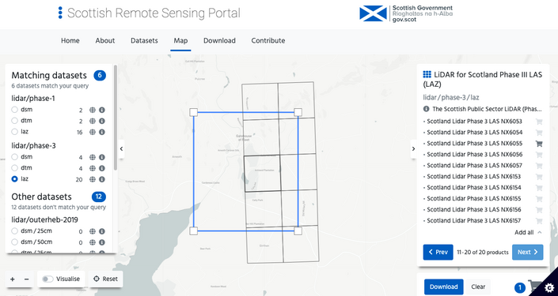
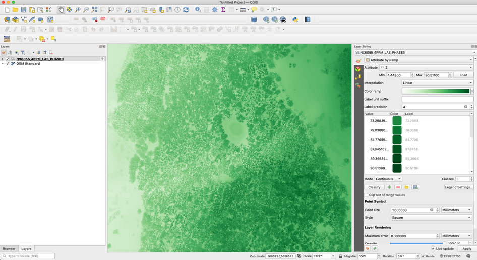
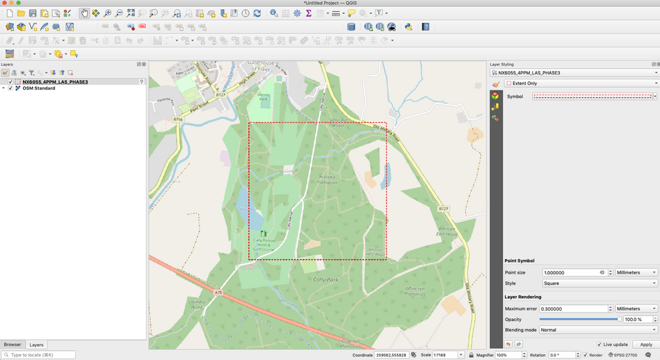
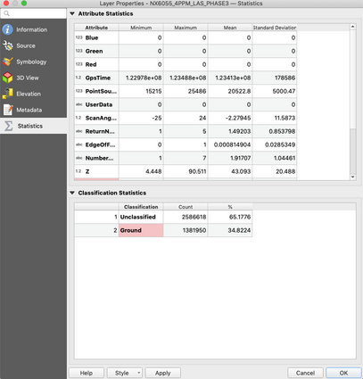

```{r setup, include = FALSE}
knitr::opts_chunk$set(echo = TRUE)
```

# Introduction

The aim of this tutorial is to guide on how to access LiDAR datasets from the Scottish Remote Sensing Portal, download the data and visualize in QGIS, a Geographic Information System software. 
This document is not intended to be fully comprehensive guide but brief overview and  a pointer to further resources.

## LiDAR

**LiDAR** stands for Light Detection and Ranging and  is an active remote sensing technique that uses a laser pulses to record earth surface. 
The LiDAR sensor emits pules of laser and measures properties of the reflected light - the timings, the angles and the wavelengths. 
The integration of GNSS (Global Navigation Satellite System) permits to accurately define the location (XYZ coordinates) of the point from which the signal was returned.  
In addition to geographic position other attributes of the LiDAR points can be recorded, for example intensity, classification, RGB values, number of returns or scan angle. 
Although, not always all the attributes are provided to the end users.

## LAS and LAZ files

LiDAR points XYZ measurement, attributes and other metadata  are stored in **LAS** files, an open format considered to be an industry standard. 
LAZ files are compressed LAS files.

## Digital Elevation Models

**Digital Surface Model** (DSM) is a numeric representation of the earth surface produced from the first return of laser signal. DSM includes objects on its surface such as vegetation or buildings.

**Digital Terrain Model** (DTM) is a numeric representation of the earth surface produced from the last return of laser signal. DTM shows the bear earth with vegetation and buildings removed.

## Scottish Remote Sensing Portal

Scottish Government and JNCC collaborates to develop an online data portal to host public sector LiDAR datasets. 
The Scottish Remote Sensing Portal currently provides access to three sets of Scottish public sector airborne LiDAR data,which can be downloaded as 10km tiles or accessed via Web Map Services (WMS). 
The data are provided as point clouds (LAZ) and raster files (GeoTIFF)
All data are shared under the Open Government Licence v3 unless otherwise stated.

The Scottish Remote Sensing Portal can be accessed at: [https://remotesensingdata.gov.scot/](https://remotesensingdata.gov.scot/).

## QGIS

QGIS is a free and open source Geographic Information System created to view, edit and analyse geospatial data.
The software  can be freely downloaded from the project website [https://qgis.org/en/site/index.html](https://qgis.org/en/site/index.html) and installed on various platforms including Windows, Linux and Mac OSX.

If you are not familiar with the software it is recommened that you familiarize yourself with the documentation section - [https://qgis.org/en/docs/index.html](https://qgis.org/en/docs/index.html)

# Downloading Data

Scottish LiDAR data can be downloaded directly from the Scottish Remote Sensing Portal.
The portal provides Graphical User Interface (GUI) in the form of interactive map.
The user can specify the area of interests by manipulating the size and location of a blue rectangle.
Once the location is specified, the left panel will display available datasets within the area. 
The user can then select between LAZ, DTM and DSM files.
Next, the user can select a particular tiles by highlighting and clicking on a grid square on the map or tile name on the right hand panel.
The selection then is added to the *shopping basket* and available in the *Download* tab.
Finally, each file needs to be downloaded separately by clicking *Download* button.
The files are compressed as ZIP-files and have to be extract before loading them into QGIS.       
In our example we have downloaded a file called *NX6055_4PPM_LAS_PHASE3.LAZ* into a data folder.

<br>
<center>

</center>
<br>

# Workings with LAZ

### Open the file

Once the LAZ file is downloaded and extracted it can be opened in QGIS.

* open a new project in QGIS
* open *Data Source Manager* and select *Point Cloud* Tab
* navigate to the LAZ file location and add to the map view
* alternatively you can drag and drop the file from the file browser

<br>
<center>

</center>
<br>

After adding the file QGIS will create a new sub-directory for EPT files indexing the LiDAR points.
As a result when panning and zooming QGIS will render only subset of points for better performance.

### Check CRS

Point Cloud should have Coordinate Reference System (CRS) assigned but it is not always a case and sometimes we have to specify the projection manually.

* right click on the question mark next to file name
* specify the CRS to OSGB 1936 / British National Grid (EPSG:27700)

<br>
<center>

</center>
<br>

### Investigate Attributes

Once the file loaded QGIS is looking at the attribute stored in the point cloud in order to apply style for visualisation - it defaults to RGB then Classification and finally  Z values. 
In our example there is no RGB attributes and the points are visualized based on the Classification.

<br>
<center>

</center>
<br>

### Step 5

<center>

</center>

### Step 6

<center>

</center>

### Step 7

<center>

</center>

### Step 8

<center>

</center>

### Step 9

<center>

</center>

### Step 10

<center>

</center>

### Step 11

<center>

</center>

# Working with Raster
# Resources
# FAQ
